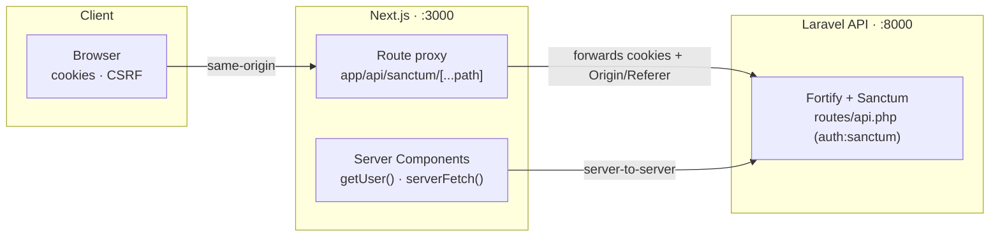
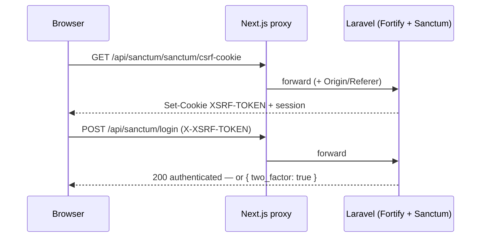

# Laravel + Next.js Starter Kit

[](https://github.com/aliziodev/laravel-next-starter-kit/actions/workflows/e2e.yml)
[](https://packagist.org/packages/aliziodev/laravel-next-starter-kit)
[](https://packagist.org/packages/aliziodev/laravel-next-starter-kit)
[](https://www.npmjs.com/package/next-sanctum)
[](https://github.com/aliziodev/laravel-next-starter-kit/blob/main/LICENSE)

A **decoupled** starter kit: a headless **Laravel** API and a separate **Next.js** (App Router) frontend, wired together with [Laravel Fortify](https://laravel.com/docs/fortify) + [Sanctum](https://laravel.com/docs/sanctum) and the [`next-sanctum`](https://www.npmjs.com/package/next-sanctum) client.

It mirrors the UI and feature set of the official [laravel/react-starter-kit](https://github.com/laravel/react-starter-kit), but instead of Inertia it ships an independent SPA that talks to Laravel over a **same-origin proxy** (no CORS).

## Architecture



The browser only ever talks to the **Next.js** origin. The route handler forwards requests to Laravel carrying the session cookie and `Origin`/`Referer`, so Sanctum treats the SPA as first-party (stateful) — no CORS. Server Components authenticate directly via `getUser()` / `serverFetch()` from `next-sanctum/server`.

### Login (cookie/SPA) flow



### Auth boundaries

Protected pages live in an **`(app)` route group** whose layout calls `getUser()` once and redirects guests to `/login` — the decoupled equivalent of `Route::middleware('auth')->group(...)`; auth pages live in **`(auth)`**. Only those groups mount the Sanctum provider, so public pages (e.g. the welcome page) stay provider-free. The authoritative security boundary is the API itself (`auth:sanctum`); `proxy.ts` is only an optimistic edge fast-path.

## Features

- **Authentication** — login, registration, password reset, password confirmation
- **Two-factor authentication** (TOTP) — QR setup, confirmation, recovery codes, login challenge
- **Passkeys** (WebAuthn) — passwordless sign-in + management, via [`laravel/passkeys`](https://github.com/laravel/passkeys) and `@laravel/passkeys`
- **Email verification** — opt-in (off by default, like the official kit — see [below](#email-verification))
- **Settings** — profile, password, appearance (light/dark/system), account deletion
- **App shell** — sidebar/header layouts, breadcrumbs, user menu, dashboard
- Dark mode (`next-themes`), toasts (`sonner`), shadcn/ui (Nova preset), Tailwind v4, React 19

## Requirements

- PHP **8.4+** and Composer
- Node **20+** and **pnpm** (`corepack enable pnpm`)

## Quick start

```bash
# 1. Scaffold the project (runs key:generate + migrate automatically)
laravel new my-app --using=aliziodev/laravel-next-starter-kit
cd my-app

# 2. Install the frontend dependencies
#    (web/.env.local is created from web/.env.example automatically)
cd web && pnpm install && cd ..

# 3. Run the API + queue + frontend together
composer run dev
```

Open **http://localhost:3000** and register an account. The API runs on **http://localhost:8000**.

> **Laravel installer prompts:** when `laravel new` asks *"run `npm install --ignore-scripts` and `npm run build`?"*, answer **no** — this kit's frontend lives in `web/` (pnpm) and is installed in step 2. A `tests.yml` warning is harmless (this kit's CI workflow is `e2e.yml`). Pick any testing framework / Laravel Boost option you like.
>
> The root `package.json` only delegates `dev`/`build` to `web/`, so `composer run dev` keeps working even though the installer rewrites its `dev` script to call `npm run dev`.

> Already have a clone? Run `composer run setup` once to copy env files, generate the app key, migrate, and install the web dependencies.

## Project structure

```
.
├── app/                # Laravel application code (Fortify actions, controllers)
├── routes/
│   ├── api.php         # Sanctum-guarded API routes (/user, /account, /passkeys)
│   └── web.php         # Headless: returns JSON at / (no Blade views)
├── config/             # fortify.php, sanctum.php, passkeys.php, …
├── database/
│   └── seeders/        # DatabaseSeeder + E2eSeeder (test users)
└── web/                # Next.js frontend (App Router, no src/)
    ├── app/            # root layout + (app)/ & (auth)/ route groups + /api/sanctum proxy
    ├── components/     # UI (shadcn in components/ui) + auth/settings components
    ├── layouts/        # app shell + auth page layouts
    ├── e2e/            # Playwright tests
    ├── lib/            # sanctum.ts (client config) · auth.ts (request-cached getUser)
    └── proxy.ts        # Next middleware (optimistic auth fast-path)
```

## Environment

Backend (`.env`):

| Variable                   | Purpose                                                              |
| -------------------------- | ------------------------------------------------------------------- |
| `FRONTEND_URL`             | Where email links (verify / reset) point back to (the SPA).         |
| `SANCTUM_STATEFUL_DOMAINS` | First-party origins for cookie auth — **must** list `:3000` + `:8000`. |
| `SESSION_DRIVER=database`  | Required for the cookie/SPA flow.                                    |
| `SESSION_COOKIE`           | Pinned to `laravel_session` for the proxy's cookie check.           |

Frontend (`web/.env.local`):

| Variable                       | Purpose                                                   |
| ------------------------------ | --------------------------------------------------------- |
| `NEXT_PUBLIC_SANCTUM_BASE_URL` | Client base URL → the same-origin proxy (`/api/sanctum`). |
| `SANCTUM_BASE_URL`             | Server-only upstream → the real Laravel origin.           |

## Security

- **No CORS:** the browser only calls the Next.js origin; the route proxy forwards to Laravel server-side. The API is never exposed cross-origin to the browser.
- **Stateful cookie auth:** Sanctum's `statefulApi()` authenticates the SPA via an `HttpOnly` session cookie. Only origins listed in `SANCTUM_STATEFUL_DOMAINS` are treated as first-party.
- **CSRF:** every mutating request carries the `XSRF-TOKEN` cookie as an `X-XSRF-TOKEN` header; `next-sanctum` attaches it and transparently refreshes + retries once on a 419.
- **Password confirmation:** sensitive actions (managing passkeys, deleting the account, enabling/disabling 2FA) sit behind Fortify's password-confirmation window (`password.confirm`).
- **Two-factor authentication:** TOTP with a required confirmation step, single-use recovery codes, and password-confirmed enable/disable.
- **Passkeys (WebAuthn):** Fortify (>= 1.37) owns the passkey routes, so the relying-party ID and `allowed_origins` are configured in `config/fortify.php` (`passkeys` key) — `allowed_origins` **must** include the SPA origin (`FRONTEND_URL`, e.g. `:3000`) since the browser runs the ceremony there. Registration requires resident keys + user verification, management is password-confirmed, and the endpoints are rate limited (`6,1`). Use **`localhost`** (not `127.0.0.1`) in development so the origin matches the relying-party ID.
- **Rate limiting:** Fortify throttles login attempts (5/min per email + IP); passkey endpoints use `throttle:6,1`.
- **API tokens:** Sanctum personal-access tokens are available for mobile / third-party clients via `Authorization: Bearer <token>` (the SPA itself uses cookies).
- **Going to production:** serve both apps over **HTTPS**; set `APP_URL`, `FRONTEND_URL`, and `SANCTUM_STATEFUL_DOMAINS` to your real domains; set `SESSION_DOMAIN` (e.g. `.example.com`) for cross-subdomain cookies; set `APP_DEBUG=false`; and configure a real mailer.

## Testing

End-to-end (Playwright, Chromium) — drives the full stack and covers login, invalid credentials, registration, logout, the **passkey ceremony** (register + passwordless sign-in, via a CDP virtual authenticator), and **2FA** (enable + login challenge, via a computed TOTP). No real device is needed.

```bash
cd web
pnpm exec playwright install chromium   # first time only
pnpm test:e2e
```

Locally the suite reuses already-running dev servers; in CI it boots them itself. GitHub Actions runs it on every push / PR (`.github/workflows/e2e.yml`).

Backend (Pest):

```bash
composer test
```

Lint & format:

```bash
cd web && pnpm lint && pnpm format:check   # Next.js / TypeScript
vendor/bin/pint --test                     # PHP (Laravel Pint)
```

## Email verification

Email verification is **off by default**, matching the official Laravel starter kit. To enable it:

1. In `web/lib/email-verification.ts`, set `MUST_VERIFY_EMAIL = true`.
2. In `app/Models/User.php`, uncomment the `MustVerifyEmail` import and add it to the `implements` list so Fortify sends verification emails.

The verify-email pages and the resend flow ship ready to use; the flag simply gates the UI enforcement.

## License

MIT.
